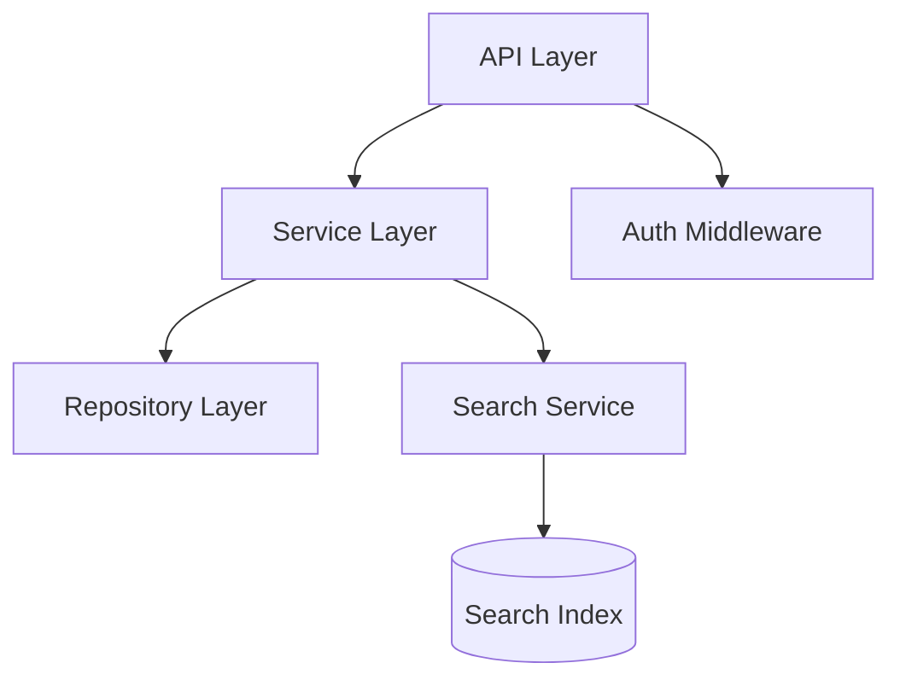

# <主题> - 架构设计 (Architecture Design)

> **生成方式**：通过 [`eas-dev-design`](../SKILL.md) 技能产出
> **上游输入**：[`<path-to-spec.md>`](<path-to-spec.md>)
> **下游消费者**：`eas-dev-plan` / `eas-dev-implement` / `eas-dev-review`
> **核心思维框架**：Deep Modules（多行为 + 小接口 + 干净接缝）

---

## 1. 模块图 (Module Diagram)

> 简单 ASCII 图或 Mermaid



```text
+----------+     +----------+     +----------+
|   API    | --> | Service  | --> | Repository|
+----------+     +----------+     +----------+
                       |
                       v
                  +----------+
                  |  Search  |
                  +----------+
```

---

## 2. 模块清单 (Module List)

> 每个模块一句话职责

| 模块 | 职责（一句话） |
|---|---|
| `<Module A>` | <职责描述> |
| `<Module B>` | <职责描述> |
| ... | |

---

## 3. 接口契约 (Interface Contract)

> 每个对外接口的签名

```typescript
// 模块 A 接口
interface ModuleAInterface {
  methodA(input: InputA): OutputA;
  methodB(input: InputB): Promise<OutputB>;
}

// 模块 B 接口
interface ModuleBInterface {
  ...
}
```

**接缝度量**：

| 接口 | 方法数 | 参数数 | 状态暴露 | 评估 |
|---|---|---|---|---|
| `<Module A>` | ≤ 3 | ≤ 3 | 无 | Deep ✓ / Shallow ✗ |
| `<Module B>` | | | | |
| ... | | | | |

---

## 4. 数据流 (Data Flow)

> 关键场景的数据走向

### 场景 1：<场景名>

```text
User → API.searchTickets(query)
    → SearchService.search(query)
    → SearchIndex.query(query)
    → [ES 内部：分词 / 评分 / 排序]
    → 返回 SearchResult[]
    → API 包装成 HTTP 200 返回
```

### 场景 2：<场景名>

```text
...
```

---

## 5. 测试策略 (Test Strategy)

> seam test + interface test 两类

### 接口测试 (Interface Test)

| 模块 | mock 什么 | 验证什么 |
|---|---|---|
| `<Module A>` | mock `<Module B>` | 验证 A 调用 B 的逻辑正确性 |
| `<Module B>` | mock `<Module C>` | 验证 B 调用 C 的逻辑正确性 |
| ... | | |

### 集成测试 (Seam Test)

| 模块 | 真实依赖 | 验证什么 |
|---|---|---|
| `<Search Service>` | testcontainers ES | 验证分词 / 评分 / 排序的正确性 |
| `<Repository>` | testcontainers DB | 验证 SQL / 索引正确性 |
| ... | | |

---

## 6. 4 核心问题回答 (Four Core Questions)

### Q1：哪些行为共享？

```yaml
shared_behaviors:
  - behavior: "<共享行为>"
    callers: [<调用方 1>, <调用方 2>]
    proposed_module: <模块名>
```

### Q2：哪些行为可独立变化？

```yaml
change_axes:
  - axis: "<变化轴>"
    affects: [<受影响的模块>]
    decision: <如何隔离>
```

### Q3：接缝在哪？

```yaml
seams:
  - seam: "<方法签名>"
    exposes: <接口面积>
    hides: <隐藏的复杂度>
```

### Q4：怎么测试接口？

```yaml
test_strategy:
  - module: <模块名>
    interface_test: <如何 mock + 验证>
    seam_test: <真实依赖 + 验证>
```

---

## 元数据 (Metadata)

| 项 | 值 |
|---|---|
| 创建时间 | <YYYY-MM-DD> |
| 更新时间 | <YYYY-MM-DD> |
| 上游输入 | <path-to-spec.md> |
| 核心思维框架 | Deep Modules (John Ousterhout) |
| 下游消费者 | `eas-dev-plan` / `eas-dev-implement` / `eas-dev-review` |
| 用户确认 | `<pending | confirmed @ YYYY-MM-DD>` |
| 关联决策 | <link to docs/decisions/...> |

---

**最后更新**：<YYYY-MM-DD>