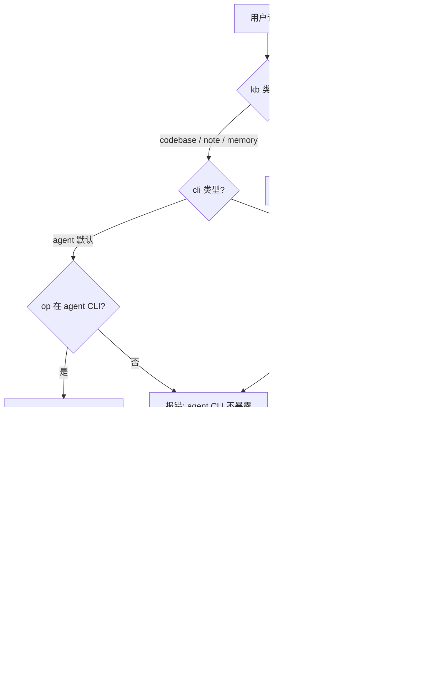

# eas-knowledge-using (知识库 CLI 引导)

## 概述 (Overview)

> **版本对齐（单一来源）**：`@easbot/codebase` / `@easbot/note` / `@easbot/memory` 各 v0.3.26；`easbot` 主包 v0.3.26；`node >=22.22.2`。本块是技能内**唯一**版本对齐声明；各 reference 引用此块避免漂移。

`eas-knowledge-using` 是 EASBot 三大知识库（`codebase` / `note` / `memory`）的 **CLI 操作引导层**。当 Agent 或用户需要执行知识库的 CLI-only 操作（`init` / `doctor` / `status` / `sync` / `index` / `consolidate` / `watch` 等）时，本技能负责：

- 识别 **知识库类型**（`codebase` / `note` / `memory`）+ **目标 CLI**（agent 主 CLI / 独立 CLI）+ **目标 CLI 操作**
- 输出 **对应 CLI 命令模板**（`easbot <kb> <op> [flags]` 或 `easbot-<kb> <op> [flags]`）
- 在 destructive 操作前 **显式索要用户授权**

> **本技能仅做 CLI 命令输出**，不直接调用 CLI；不解释 agent 内建检索 / 持久化接口的内部行为。

> **关键点**：**agent CLI 与独立 CLI 是两套独立入口**，子命令集合 / flags 形态有差异。务必先确认目标 CLI 再生成命令（详见 [§双 CLI 入口与安装](#双-cli-入口与安装-entry-points--install) 与各 reference）。

## 双 CLI 入口与安装 (Entry Points & Install)

### 入口矩阵

| 入口                     | 命令前缀            | 安装方式                                                      | 适用                                                                                                       |
| ------------------------ | ------------------- | ------------------------------------------------------------- | ---------------------------------------------------------------------------------------------------------- |
| **Agent 主 CLI**         | `easbot <kb> *`     | `@easbot/agent`（easbot 主包内置，pnpm workspace 已绑定）     | LLM 编程场景；走 commander 子集过滤（`codebase` 13 / `note` 11 / `memory` 12）                             |
| **独立 CLI（codebase）** | `easbot-codebase *` | `pnpm add @easbot/codebase` 或 `npm install @easbot/codebase` | 终端调试 / 一次性操作；全 23 个子命令                                                                      |
| **独立 CLI（note）**     | `easbot-note *`     | `pnpm add @easbot/note` 或 `npm install @easbot/note`         | 终端调试 / 一次性操作；全 **12** 个子命令                                                                  |
| **独立 CLI（memory）**   | `easbot-memory *`   | `pnpm add @easbot/memory` 或 `npm install @easbot/memory`     | 终端调试 / 一次性操作；全 12 个子命令；**per-agent 存储**需 `protocol.json`                                |
| **MCP server**           | `<kb> mcp` 子命令   | 同对应独立 CLI                                                | 其他 AI Agent 通过 MCP 协议消费（codebase **9** / note **8** / memory **10** 个工具；详见各 reference §0） |

### 独立 CLI 安装命令（按包）

```bash
# Agent 主 CLI（用户在 agent 里用 `easbot <kb> *`；非 LLM 场景也可独立安装）
pnpm add -g @easbot/agent        # 全局安装
pnpm add @easbot/agent           # 项目本地（与 easbot 项目平级）

# 独立 CLI（用户在终端直接跑 `easbot-<kb> *`）
pnpm add @easbot/codebase        # codebase 知识库（23 个子命令）
pnpm add @easbot/note            # note 知识库（12 个子命令）
pnpm add @easbot/memory          # memory 知识库（12 个子命令；per-agent）
```

> 三个知识库包**无相互依赖**——单独安装任一个都能跑独立的 CLI。
> 安装后 bin 路径（pnpm）：`node_modules/.bin/easbot` / `easbot-codebase` / `easbot-note` / `easbot-memory`；全局安装可直接调命令名。
> npm 用户等价命令：`npm install -g @easbot/agent` 等。

### 独立 CLI 全局选项（三包通用）

```bash
easbot-<kb> [--cwd <dir>] [--config <path>] [--log-level DEBUG|INFO|WARN|ERROR] [--print-logs] [--debug] <command>
```

| 选项              | 说明                                   |
| ----------------- | -------------------------------------- |
| `--cwd <dir>`     | 覆盖工作区目录（默认 `process.cwd()`） |
| `--config <path>` | 覆盖全局配置文件路径                   |
| `--log-level <L>` | 日志级别（默认 `INFO`）                |
| `--print-logs`    | 把日志打印到 stderr                    |
| `--debug`         | 等价 `--log-level DEBUG`               |

> 全局选项必须在子命令之前；agent CLI 不暴露这些（agent 内部统一注入 ctx.worktree）。
>
> **MCP server 启动**：三包独立 CLI 都暴露 `<kb> mcp` 子命令（`<kb>` = codebase / note / memory），启动 stdio JSON-RPC server；启动后工具清单详见各 reference §0.3（codebase） / §0.2（note） / §0.3（memory）。Agent CLI 不暴露 `mcp` 子命令。

### memory 独立 CLI agentId 解析

memory 是 **per-agent 存储**，独立 CLI 跑时按以下优先级解析 `agentId`：

1. **`.easbot/protocol.json`** 的 `metadata.agentId`（推荐；由 easbot agent 自动写入）
2. 环境变量 `EASBOT_AGENT_ID`
3. 回退到 `'default'`（仅对 `status` / `doctor` 等全局视图有意义）

**手动准备**（独立 CLI 无 agent 上下文时）：

```bash
mkdir -p .easbot
cat > .easbot/protocol.json <<EOF
{
  "metadata": { "agentId": "my-custom-agent", "preferredName": "小莫" }
}
EOF
```

> 完整安装与调用细节见各 reference 的 §0 节（[codebase §0](references/codebase.md) / [note §0](references/note.md) / [memory §0](references/memory.md)）。

## 何时使用 (When to Use)

### 触发场景 (Triggers)

- 用户说 "用 CLI 跑 {kb} {op}" / "帮我初始化 {kb}" / "跑下 {kb} doctor" / "重建 {kb} 索引"
- 用户说 "查下 {kb} 状态" / "{kb} db 健康吗" / "codebase 健康诊断"
- 用户说 "监听 {kb} 文件变化" / "启动 {kb} watcher" / "note 文件变更自动同步" / "note watch"
- Agent 主动判断某个操作只能通过 CLI 完成（`init` / `doctor` / `consolidate` / `recreate` / `clear` / `mcp` / `watch` 等常见 CLI-only 操作）
- 用户明确指定 `easbot <kb>` 或 `easbot-<kb>` 命令前缀

### 不适用场景 (Out of Scope)

- ❌ **Agent 已有的内建检索 / 持久化接口** → 直接调用 agent 的内置方法；本技能只处理 CLI 入口
- ❌ **临时一次性脚本** → 直接用 `bash` 工具
- ❌ **CLI 帮助以外的 side effect** → 本技能不直接调用 CLI

---

## 快速参考 (Quick Reference)

### 1. 双 CLI 子命令数量对照（与代码同步）

| 知识库       | Agent CLI (`easbot <kb> *`)                                                                                                   | 独立 CLI (`easbot-<kb> *`)                                                                                                                   | 差异说明                                                         |
| ------------ | ----------------------------------------------------------------------------------------------------------------------------- | -------------------------------------------------------------------------------------------------------------------------------------------- | ---------------------------------------------------------------- |
| **codebase** | **13 个**（`init`/`status`/`doctor`/`sync`/`config`/`mcp` + `query`/`node`/`context`/`impact`/`callers`/`callees`/`explore`） | **23 个**（agent 13 + 10 个仅 standalone：`index`/`recreate`/`clear`/`upgrade`/`embed-status`/`watch`/`stop`/`dead-code`/`circular`/`path`） | 决策 0089 过滤；destructive / 长耗时 / 低频诊断不暴露给 LLM      |
| **note**     | **11 个**                                                                                                                     | **12 个**（agent 11 + `watch` 独立 CLI only；长驻进程不上 agent CLI）                                                                        | 子命令数差 1；`watch` 触发后实时打印文件事件 + sync 触发/完成    |
| **memory**   | **12 个**                                                                                                                     | **12 个**（子命令集合相同，但 flags / 简写差异）                                                                                             | 子命令数同；agent CLI 用 commander 简写 `-q`/`-l`/`-c`/`-i`/`-s` |

### 2. flags 形态差异速查

| 维度                                | Agent CLI (`easbot <kb> *`)                                              | 独立 CLI (`easbot-<kb> *`)                                                                                                                                                                      |
| ----------------------------------- | ------------------------------------------------------------------------ | ----------------------------------------------------------------------------------------------------------------------------------------------------------------------------------------------- |
| **flags 形态**                      | `--flag <value>`（commander space-form）                                 | 因包而异：codebase 独立 CLI **只**支持 `--flag=<value>`（`=`-form）；note 独立 CLI **同时**支持 `--flag <value>` 和 `--flag=<value>`；memory 独立 CLI **只**支持 `--flag <value>`（space-form） |
| **`[dir]` positional**              | 部分接受（commander 解析后注入 options）                                 | 普遍接受                                                                                                                                                                                        |
| **`--agent` flag**                  | **完全移除**（agentId 走 ctx）                                           | **parse 函数静默忽略**（agentId 走 ctx；两端都不接收 `--agent`）                                                                                                                                |
| **`--workspace-dir` flag**          | **两端都不暴露**（workspaceDir 走 ctx 自动注入；CLI parse 函数无此解析） | **两端都不暴露**（同上；workspaceDir 由 cli-handler 注入，`opts.workspaceDir ?? process.cwd()` 兜底）                                                                                           |
| **`--kind` / `--direction` 已废弃** | **报 unknown option**（commander 严格）                                  | **静默忽略**（保持向后兼容旧脚本）                                                                                                                                                              |
| **`--depth` vs `--max-depth`**      | 只接受 `--max-depth`（ADR 0097）                                         | `--max-depth` 与 `--depth` 都接受（`--depth` 是别名）                                                                                                                                           |

### 3. 每个 kb 的完整 CLI 命令手册（按 CLI 区分）

> - [codebase CLI 手册](references/codebase.md) — **双 CLI 矩阵**：13 vs 23 子命令 + 每个共用子命令 flags 双 column 对照
> - [note CLI 手册](references/note.md) — **双 CLI 矩阵**：11 vs 12 子命令（独立 CLI 多 `watch`）+ 每个子命令 flags 双 column 对照（含 ADR 0097 graph 重构）
> - [memory CLI 手册](references/memory.md) — **双 CLI 矩阵**：12 vs 12 子命令 + 每个子命令 flags 双 column 对照

**核心约束**：

- **优先走 Agent 内建接口**：每个 kb 的常用 op（`query` / `search` / `recall` / `remember` 等）应走 agent 已有的内建方法，不走 CLI
- **CLI-only op**：`{kb} init` / `codebase index` / `{kb} status` / `{kb} doctor` / `memory consolidate` / `codebase recreate` / `codebase clear` / `codebase watch` / `note watch` / `{kb} mcp` 等 — 这些 op **必须 CLI**
- **三个知识库独立命令空间**：`easbot codebase *` / `easbot note *` / `easbot memory *`，互不混用
- **两套 CLI 各自独立**：`easbot <kb> *`（agent CLI）≠ `easbot-<kb> *`（独立 CLI）；子命令数 / flags 形态有差异
- **destructive op 必须显式授权**：`init --force` / `recreate --force` / `clear --force` / `forget` / `note remove --confirm` / `doctor --repair`
- **agent CLI 不暴露 `--agent` / `--workspace-dir`**：agentId 走 ctx（独立 CLI 静默忽略）；workspaceDir 走 ctx 自动注入

---

## 工作流 (Workflow)

### 阶段 1：detect-signal — 识别信号（kb + cli + op 三元组）

**输入**：用户的自然语言请求。

**解析逻辑**：

1. **识别 kb 类型**：用户明确指定 "codebase" / "note" / "memory"
2. **识别目标 CLI**：
   - 用户说 "用 `easbot` 主命令" / "在 agent 里跑" / 默认 → CLI = **agent CLI**（`easbot <kb> *`）
   - 用户说 "用独立 CLI" / "easbot-<kb>" / "从终端跑" → CLI = **独立 CLI**（`easbot-<kb> *`）
   - 默认选 agent CLI（LLM 编程场景的主入口）
3. **识别 op 类型**：按用户用词映射到对应 kb 的 op（`init` / `doctor` / `status` / `sync` / `index` / `consolidate` / `recreate` / `clear` / `watch` / `mcp` / `forget` 等）。**每个 op 在该 (kb, cli) 下是否可用**，以各 reference §1 / §2 为准（例如 `codebase index` / `recreate` / `clear` 只在独立 CLI 可用，agent CLI 报 unknown；`note graph` agent CLI 用 `--max-depth`，独立 CLI 用 `--depth`）。

**退出条件**：已确认 `kb ∈ {codebase, note, memory}` + `cli ∈ {agent, standalone}` + `op` 在该 (kb, cli) 的 op 集合内。

**判断流程图**：



### 阶段 2：get-permission — 用户授权

按 op 类型索要不同强度的授权：

| op                                                   | 授权提示                                                               | 是否阻塞                                |
| ---------------------------------------------------- | ---------------------------------------------------------------------- | --------------------------------------- |
| `init` / `init --force` / `index`                    | "Will create `<workspaceDir>/.easbot/{kb}.json` + db. Continue? (y/N)" | **阻塞**（创建 workspace 资源）         |
| `doctor`                                             | 只读检查，无确认                                                       | **非阻塞**                              |
| `doctor --repair`                                    | "Will modify db. Continue? (y/N)"                                      | **阻塞**（destructive）                 |
| `codebase recreate` / `codebase clear`（仅独立 CLI） | "Will destroy db (irreversible). Continue? (y/N)"                      | **阻塞**（destructive）                 |
| `memory forget`                                      | "Will delete matching facts. Continue? (y/N)"                          | **阻塞**（destructive）                 |
| `note remove --confirm` / `--force`                  | "Will delete note + cascade KG. Continue? (y/N)"                       | **阻塞**（destructive）                 |
| `status` / `sync`                                    | 只读 / 增量更新，可直接执行                                            | **非阻塞**（sync 高负载需提示但不阻塞） |

**退出条件**：destructive op 必须用户回复 `y` / `yes` / `确认`；只读 op 可直接进入下一阶段。

### 阶段 3：run-cli — 输出 CLI 命令模板

按目标 (kb, cli, op) 生成对应命令：

**模板格式**：

```bash
# Agent CLI（<kb> = codebase | note | memory；<op> 见各 reference §1；<flags> 见 §2）
easbot <kb> <op> [flags] [positional-args]

# 或独立 CLI
easbot-<kb> <op> [flags] [positional-args]
```

> **命令细节见**：[references/codebase.md](references/codebase.md) / [references/note.md](references/note.md) / [references/memory.md](references/memory.md)。
>
> **占位符约定**：`<kb>` / `<op>` / `<flags>` / `[positional-args]` 全部是尖括号/方括号占位符，**不要当成 shell 变量**。Agent 必须先把占位符替换成真实值再交给用户。

**destructive 三步法（必读）**：破坏性 op（`init --force` / `recreate` / `clear` / `forget` / `doctor --repair` / `note remove`）必须配套三步走，**禁止直接生成执行命令**：

```bash
# Step 1：先 dry-run 预览（CLI 默认行为；绝大多数 destructive op 支持 --dry-run）
easbot-<kb> <destructive-op> <dry-run-flags>

# Step 2：把 Step 1 的输出交给用户确认（输出"Will delete N rows. Continue? (y/N)"）
#   用户回复 y / yes / 确认 → 才进入 Step 3；拒绝 → 回退到 detect-signal 重选 op

# Step 3：实际执行（带 --force / --confirm / --yes 等确认 flag）
easbot-<kb> <destructive-op> <confirm-flags>
```

> 完整 dry-run / confirm flag 矩阵见 [references/memory.md §2.4 `forget`](references/memory.md) / [references/codebase.md §3.2 `recreate` / §3.3 `clear`](references/codebase.md) / [references/note.md §2.7 `remove`](references/note.md)。

**反模式**：

- ❌ 不要让 Agent 自己执行 CLI 命令（agent 不应直接调用 destructive CLI）
- ❌ 不要在 CLI 命令里加 `agentId` / `--workspace-dir` 等参数（走 ctx 注入，CLI 端用默认即可）
- ❌ 不要跨 kb 编造 op（如 `easbot memory reset` 不存在；`easbot codebase search` 不存在）
- ❌ 不要跨 CLI 错用子命令（如 `easbot codebase index` 不存在 → 必须用 `easbot-codebase index`）
- ❌ 不要编造 flags（如 `--limit` / `--agent` / `--kind` 等可能已被废弃或重命名）→ 查 reference 确认
- ❌ **agent CLI 传 `--kind` 报错**（commander 严格）—— 独立 CLI 才静默忽略
- ❌ **破坏性 op 直接生成执行命令**（跳过 dry-run）→ ✅ 走 destructive 三步法

### 阶段 4：verify-retry — 验证结果

CLI 执行后，Agent 不能自动获得成功反馈。应**主动告知**："CLI 执行后请告知结果"。用户回复 "成功" / "done" / "ok" → 视为操作完成。

---

## 与其他技能的协作 (Relationships with Other Skills)

- **本技能独立加载**：不依赖任何前置技能，可在隔离 context 下直接激活
- **匹配机制**：由 Agent 按本技能的 frontmatter `description` 自行匹配，无需索引注册

---

## 常见错误 (Common Mistakes)

### CLI 路由错误（agent vs 独立 CLI 混用）

- ❌ `easbot codebase index` —— **agent CLI 不暴露**（决策 0089）；用户用 `easbot-codebase index`
- ❌ `easbot codebase recreate` / `clear` —— **agent CLI 不暴露**（destructive）；用户用独立 CLI
- ❌ `easbot codebase watch` / `stop` —— **agent CLI 不暴露**（长驻进程）
- ❌ `easbot note watch` —— **agent CLI 不暴露**（长驻进程 + 暂未桥接；仅独立 CLI 落地）
- ❌ `easbot codebase dead-code` / `circular` / `path` —— **agent CLI 不暴露**（低频诊断）
- ✅ `easbot note graph --max-depth` —— agent CLI 支持
- ❌ `easbot-note graph --max-depth` —— **独立 CLI 不支持** `--max-depth`，要用 `--depth`
- ❌ `easbot memory graph --depth` —— **agent CLI 不支持** `--depth`，要用 `--max-depth`
- ✅ `easbot-memory graph --depth` —— 独立 CLI 支持（depth 是别名）
- ✅ `easbot note search --max-edges-per-node` —— **两端都支持** `--rerank` / `--include-graph` / `--min-score` / `--max-edges-per-node`（agent CLI 通过 commander 简写）
- ✅ `easbot note sync --repair` —— **两端都支持** `--repair` / `--repair-only` / `--async` / `--quiet`
- ❌ `easbot note remove --force`（agent CLI） ✅ vs `easbot-note remove --force`（独立 CLI 不支持，用 `--confirm`）

### flags 形态错误

- ❌ 让 Agent 自行执行 `easbot {kb} init` → ✅ 仅输出命令，让用户执行
- ❌ 跳过用户授权直接生成 init --force / recreate / clear / forget 命令 → ✅ destructive op 必须显式授权
- ❌ 跨 kb 错用命令（如 `easbot memory reset` / `easbot codebase search`）→ ✅ 先查 reference 确认 kb 的 op 集合
- ❌ 把常用 op（如 `query` / `search` / `recall`）也走 CLI → ✅ 那些 op 走 Agent 内建接口，本技能只处理 CLI-only op
- ❌ 用户拒绝 init 时仍继续引导 doctor → ✅ 拒绝后回退上报，由用户决定下一步
- ❌ 用 `--agent <id>` flag 跑 memory 命令 → ✅ agentId 走 ctx（独立 CLI 读 `protocol.json`）；CLI 端不接收 `--agent`
- ❌ 用 `--query <text>` 跑 memory `forget` → ✅ `forget` 不支持文本查询；走 `--fact-id` / `--category` / `--from` / `--to`
- ❌ 用 `--workspace-dir <dir>` 跑 agent CLI `memory init` → ✅ agent CLI 不暴露 `--workspace-dir`（**两端都不暴露**；传 `[dir]` positional 即可）
- ❌ 用 `--workspace-dir <dir>` 跑独立 CLI `easbot-memory init` → ✅ 独立 CLI 也不暴露 `--workspace-dir`

---

## 参考资料 (References)

- [codebase CLI 使用手册](references/codebase.md) — `easbot codebase *` (13) vs `easbot-codebase *` (23) 双 CLI 矩阵 + flags 对照
- [note CLI 使用手册](references/note.md) — `easbot note *` vs `easbot-note *` 双 CLI flags 对照（含 ADR 0097 graph 重构）
- [memory CLI 使用手册](references/memory.md) — `easbot memory *` vs `easbot-memory *` 双 CLI flags 对照（commander 简写 `-q/-l/-c/-i/-s` vs 独立 CLI 完整形式）
